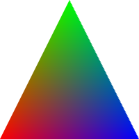

# Beam
Build your WebGL renderer with plugins.


## Intro
Beam is a library that helps you building WebGL renderers. It's **NOT** a renderer or 3D render engine by itself. Instead, Beam provides some essential abstractions, allowing you to fully control WebGL with a very small and easy-to-use API surface.

What are we talking about? Briefly, there are two fundamental features shipped by Beam, within 10KB the size:

* Beam classifies all the complex WebGL conpects into **Plugins** and **Resources**. You can reuse "shaders", the program running on GPU, as plugins, just like reusing Babel plugins or React components.
* Beam provides a fully **composable, chainable, functional drawing** API. Writing render logic of your engine with Beam, is just as simple as writing jQuery-style chaining calls.


## Hello World with Beam
Let's start with an example using Beam to render a colorful triangle, which is what many WebGL tutorials struggle to elaborate:



Before we begin, keep in mind that Beam only has 3 core API: **plugin** / **resource** / **draw**. How to render stuffs only based on these 3 API? See below:

``` js
import { Beam, ResourceTypes } from 'beam-gl'
import { PolygonColor } from 'beam-gl/gallery/plugins/basic-graphics-plugins'
const { DataBuffers, IndexBuffer } = ResourceTypes

// Init Beam instance
const canvas = document.querySelector('canvas')
const beam = new Beam(canvas)

// Init a shade plugin, which can render colorful polygons
const plugin = beam.plugin(PolygonColor)

// Init data buffer resource with triangle positions and colors
const dataBuffers = beam.resource(DataBuffers, {
  position: [
    -1, -1, 0, // vertex 0
    0, 1, 0, // vertex 1
    1, -1, 0 // vertex 2
  ],
  color: [
    1, 0, 0, // vertex 0
    0, 1, 0, // vertex 1
    0, 0, 1 // vertex 2
  ]
})
// Init index buffer resource with 3 indices
const indexBuffer = beam.resource(IndexBuffer, { array: [0, 1, 2] })

// Clear the screen, then draw a frame with plugin and buffer resources
beam.clear().draw(plugin, dataBuffers, indexBuffer)
```

And that's all.


## Why Beam?
If you're fluent with WebGL, you'll find out that this example fully complies with what a typical WebGL app should do: *creating shaders, creating buffers, uploading buffer data, making draw calls*...But when using Beam, you can use a **highly expressive** API to describe the logic, with **high flexibility of control**.

What does *expressiveness* and *flexibiliy* means? In short there're two points:

* For expressiveness, the **draw** API supports chaining calls. Not only can you gracefully drawing different contents, but also nesting drawing logics. And on nesting, the GL context state can be even automatically kept in sync with function scopes!
* For flexibiliy, the chaining methods you're calling, are all free for you to define. For example, you can defines custom methods like `beam.alpha().cull().draw()` for your case, and the `alpha` / `cull` methods can be declared by yourself. In a word, you have full control over the WebGL state.

Besides, Beam is able to support an "optimizer" based on command sorting, which can reduce performance overhead on state changing between draw calls. This feature is opt-in, you can provide your fine-grained optimization for your use case.

> The command sorting feature is not implemented yet.

On top of Beam, you can easily design your own WebGL render engines aiming at different graphics apps. **Remember, Beam is designed for building render engines, Beam itselt is NOT a render engine**.


## Resources

### Examples
What can Beam do for now? Checkout [**Beam Examples**](./examples.html) and rock!

### Documentation
> WIP

* Beam API
* Resource Design in Beam
* Command Design in Beam
